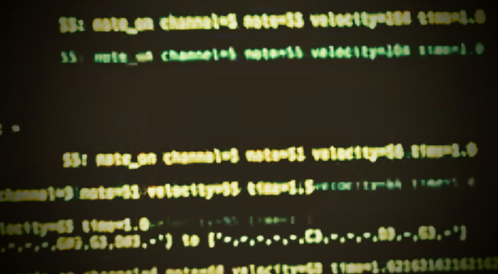

# Concept

The integration of chaos theory, experimentation, constraints, and repetitions represents a profound approach in artistic creation, particularly within the realm of music composition. This approach posits that listeners possess the innate ability to discern patterns, rhythms, and melodies within music generated through such methods, thereby emphasizing the subjective interpretation of auditory experiences. Composers employ generative techniques to simulate the spontaneous and unpredictable nature of our surroundings, utilizing random elements and looping them within the framework of basic music theory. This methodology echoes the techniques pioneered by influential artists like Brian Eno, who crafted compositions from disparate tape loops, randomly spliced and played back at varying intervals. Moreover, the application of sound effects further enriches the creative palette, offering a diverse array of sonic possibilities.

By leveraging algorithmic processes with customizable levels of randomization, composers cultivate a fertile ground for exploration and experimentation. This iterative approach encourages live sound processing, allowing for the infusion of personal expression and individual style. As composers immerse themselves in this dynamic interplay between chance and intention, they uncover rhythmic motifs and melodic structures that resonate with their creative vision. Ultimately, algorithmic music serves as a powerful tool for artistic expression, challenging conventional notions of authorship and creativity.

In presenting the music created through this paradigm, I find satisfaction in the outcome, underscoring the potential of these techniques to inspire new avenues of artistic exploration. I posit that further inquiry into similar methodologies, particularly within the burgeoning field of artificial intelligence, holds promise for expanding the horizons of artistic innovation and providing alternative pathways for creative expression.

# Software

## Installation

### Requirements

* Python 3.11.3
* Poetry

### Setup

```python
poetry install
```

### Run
```shell
poetry run python src/generation_x
```

#### Usage
```text
usage: Generation-X [-h] [-mst {c,c#,d,d#,e,f,f#,g,g#,a,a#,b}] [-mss {major,minor,harmonic_minor,melodic_minor}] [-t 10-300] [-r 0-100]

Symbolic music data generator for Elektron Model:Cycles and Maschine Jam

options:
  -h, --help            show this help message and exit
  -mst {c,c#,d,d#,e,f,f#,g,g#,a,a#,b}, --music_scale_tonic {c,c#,d,d#,e,f,f#,g,g#,a,a#,b}
                        Music scale tonic
  -mss {major,minor,harmonic_minor,melodic_minor}, --music_scale_type {major,minor,harmonic_minor,melodic_minor}
                        Music scale type
  -t 10-300, --tempo_bpm 10-300
                        Main tempo from which different sequences will be generated. Sequences can be generated with different tempos based on this value.
  -r 0-100, --rest_factor 0-100
                        Rest probability factor for random type generated sequences
```

## Diagram

(random walk &/| random arpeggios * 6->> elektron cycles <-> display on machine jam with some dice and mute control)


## Example initial settings

```python
from models import MusicScale, MusicScaleType
base_tempo = 10
pause_factor = 70
sequences_config = [
    f'a|3|5:-1.1|2:-1.1|{base_tempo}|3th|d|7/8',
    f'a|2|3|2:-1.1|{base_tempo}|3th down|f|6/8',
    f'a|2|2|2:-1.1|{base_tempo}|2th down|g|4/4',
    f'r|3|4|{int(base_tempo/2)}|{pause_factor}|6/8',
    f'r|3|3|{base_tempo}:-10.10|{pause_factor}|5/4',
    f'r|3|4|{base_tempo}:-10.10|{pause_factor}+10|4/4'
]
music_scale = MusicScale(scale=MusicScaleType.NATURAL_MINOR, tonic='c')
```

where:

```
    """
    # r|5:-1.1|4:-1.1|30:-10.10|30|4/4
    # stays for: random | octaves_length_fn | root_octave_fn | tempo_fn | pause_factor | meter

    # a|3:-1.1|6:-1.1|2:-1.1|30:-5.5|3th|g|4/4
    # stays for: arpeggio | bars_length_fn | total_notes_fn | root_octave_fn | tempo_fn | mode | start_note | meter

    # x.y specify optional randomization where: x=min, y=max, value=value+random(min, max)
    """
```

## Known issues

* every sequence has his own thread, all are weakly synchronized, can be perceived as another chaotic parameter to the general technique but is problematic for rhythm based compositions

## TODO

* command line arguments with optional interactive questionnaire for initial settings
* randomization for every possible parameter
* exposing control with dice to every parameter, not only notes generation 
* computer keyboard support if no Machine Jam connected
* not a clean code ;)
* docs and tests!

# Performance

Run software with initial settings and focus on sound processing with usage of the external guitar effects.
Playing with mute button for enabling / disabling sequences as a function for arrangement as well as dice function for melody changes.  

# Outcome

Please check above playlist of music generated with this project.



[Soundcloud playlist](https://soundcloud.com/blackcookies/sets/gen-x-elektron-model-cycles-machine-jam/s-0gnUamTzWvK?si=8ac50d5e9e704ffdbaef6674c52b6341&utm_source=clipboard&utm_medium=text&utm_campaign=social_sharing)